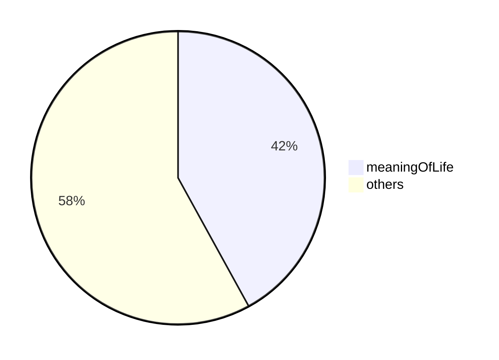
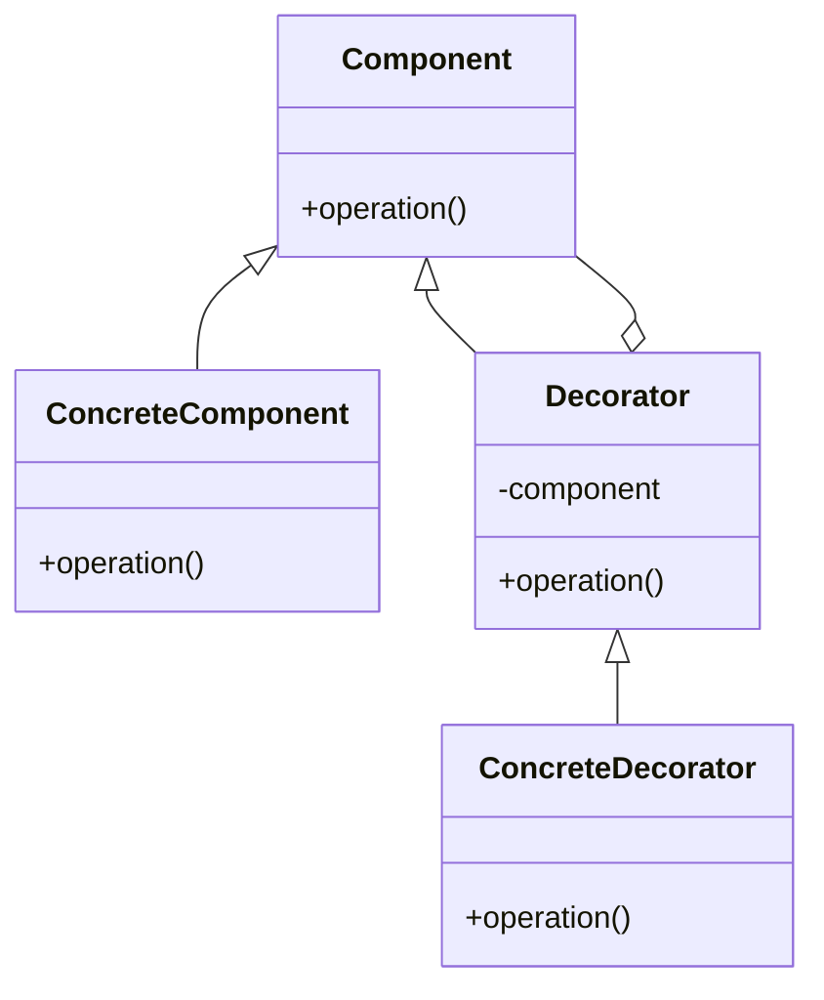

# welcome to chapter 1

Examples

## math

This template uses katex. 

For exampple,

```
$$
\begin{bmatrix}
a & b \\
c & d \\
\end{bmatrix}
$$
```
This is converted to:

$$
\begin{bmatrix}
a & b \\
c & d \\
\end{bmatrix}
$$

You can use `$$` instead of ``

You can find further information here.

https://katex.org/

## Mermaid

You can draw diagrams such as state diagrams,sequence diagrams, class diagrams and charts using mermaid syntax.

note: remove trailing `\` after triple `\`` when you use mermaid block.

````txt


This is converted into this.


Another example is class diagram.



For more information, visit https://mermaid-js.github.io
