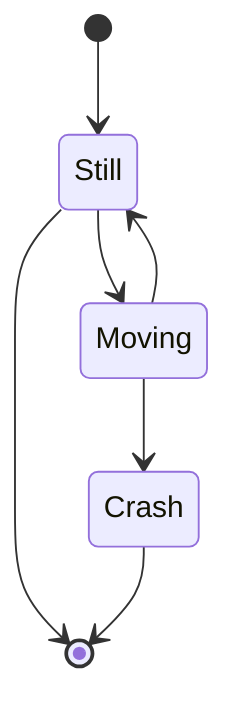

# 1章

## Examples

### markdown

```md
# みだし１

## みだし２

### みだし３

吾輩は[猫](https://typelevel.org/cats/)である。名前はまだ無い。

引用

> 山路やまみちを登りながら、こう考えた。
>
>智ちに働けば角かどが立つ。情じょうに棹さおさせば流される。意地を通とおせば窮屈きゅうくつだ。とかくに人の世は住みにくい。
>
> 夏目漱石 「草枕」

テーブル

| みだし A  | みだし B |
| ------------- | ------------- |
| 1  | 2  |
| 3  | 4  |

脚注へ.[^2]

---

[^2]: 本文へ

```

# みだし１

## みだし２

### みだし３

吾輩は[猫](https://typelevel.org/cats/)である。名前はまだ無い。

引用

> 山路やまみちを登りながら、こう考えた。
>
>智ちに働けば角かどが立つ。情じょうに棹さおさせば流される。意地を通とおせば窮屈きゅうくつだ。とかくに人の世は住みにくい。
>
> 夏目漱石 「草枕」

テーブル

| みだし A  | みだし B |
| ------------- | ------------- |
| 1  | 2  |
| 3  | 4  |

脚注へ.[^2]

---

[^2]: 本文へ


### code highlight

```javascript
console.log("hello world!")
```


### 数式

このテンプレートは katex を使っています. 


```
$$
\begin{bmatrix}
a & b \\
c & d \\
\end{bmatrix}
$$
```
上のように入力すると次の結果が得られます.

$$
\begin{bmatrix}
a & b \\
c & d \\
\end{bmatrix}
$$

`$$`を``の代わりに使えます.


その他詳細は以下

https://katex.org/

### Mermaid

Mermaid を使って図を描画できます.

※ 3つの`\``直後の末尾の`\` を削除してください.



その他詳細は  https://mermaid-js.github.io を参照されたし.
