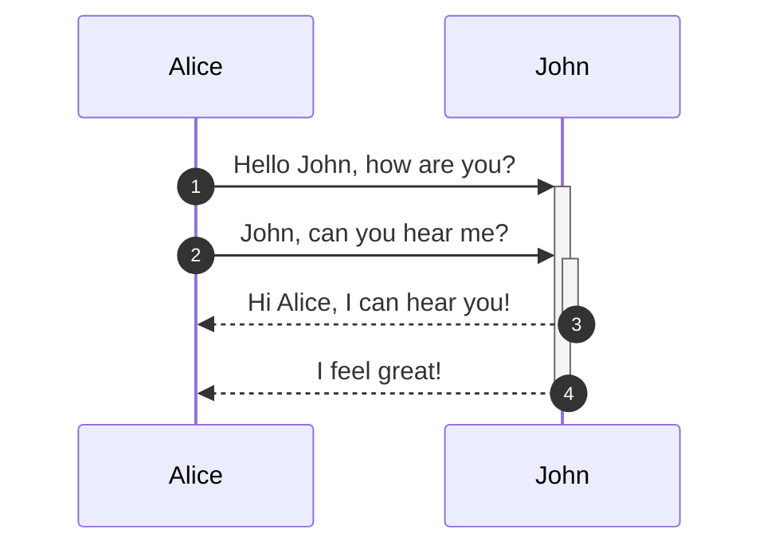
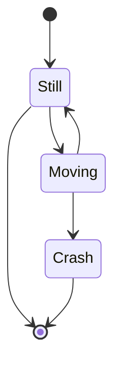

## Mermaid plugin for GitBook

[](https://npmjs.org/package/gitbook-plugin-mermaid-newface/)  
[](https://npmjs.org/package/gitbook-plugin-mermaid-newface)
[](https://npmjs.org/package/gitbook-plugin-mermaid-newface)
[](https://npmjs.org/package/gitbook-plugin-mermaid-newface)

Plugin for [GitBook](https://github.com/GitbookIO/gitbook) 3 which renders [Mermaid](https://mermaid-js.github.io/mermaid) diagrams and flow charts detected in the book markdown.  

💚 **THIS PLUGIN WAS BORN TO USING MERMAID V8.5 AND LATER AT GITBOOK** 💚

🎊 **NOW WE SWITCH TO USE THE [mermaid-cli](https://www.npmjs.com/package/@mermaid-js/mermaid-cli) FOR A BETTER EXPERIENCE AND PDF SUPPORT** 👍

### Support status

#### Working
- Flowcharts
- Sequence diagrams
- Gantt diagrams
- Pie chart diagrams
- Class diagram [NEW!!!!!]
- Git graph - experimental at v8.5
- Entity Relationship Diagrams - experimental at v8.5
- State diagrams
- User Journey Diagram [NEW!!!!!]


#### Not Working yet
- Class diagrams - experimental at v8.5


### How to install it?

You can use install via **NPM** / **yarn**:

```bash
$ npm install gitbook-plugin-mermaid-newface
# or
$ yarn add gitbook-plugin-mermaid-newface
```

And use it for your book with in the book.json:

```json
{
  "plugins": ["mermaid-newface"]
}
```

### How to use it?

Just put the code into fenced code block and tag it **mermaid** key word like this:





## Config

If you want to change the settings of mermaid, please add `pluginsConfig` in the book.json:

```json
{
  "plugins": ["mermaid-newface"],
  "pluginsConfig": {
    "mermaid-newface": {
      "theme": "neutral" // default, forest, dar, natural. see https://mermaid-js.github.io/mermaid/#/mermaidAPI?id=theme
    }
  }
}
```

## Linux issue
If you are using Docker, you will need to add a following configurations. 

Create a puppeteer-config.json file in the your book directory root:  
```json
{
  "args": ["--no-sandbox"]
}
```

See. [Linux sandbox issue](https://github.com/mermaidjs/mermaid.cli#linux-sandbox-issue)

